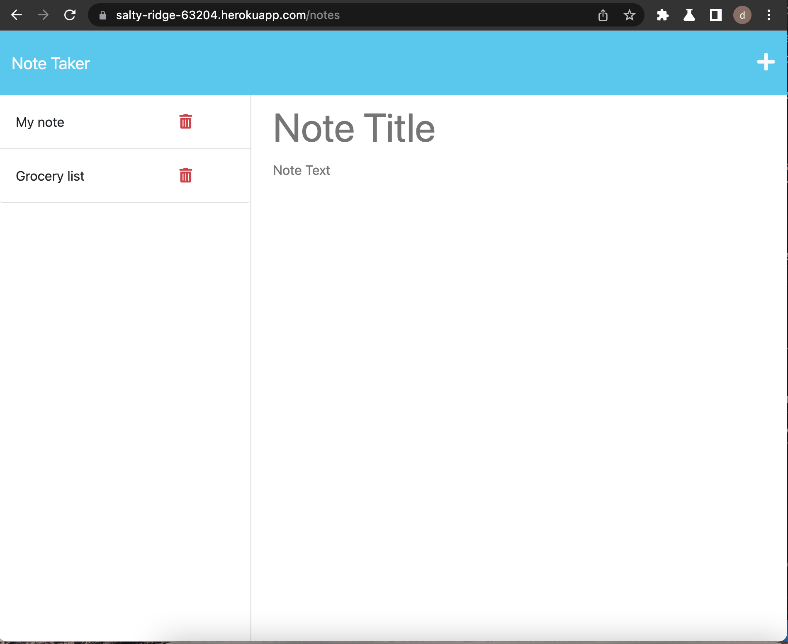

# Note Taker

## Description

This application enables user to quickly write, view, and delete notes. I built this application because as a busy professional myself, I have many things to do over the course of the day and week, and need help keeping track of it all. This application helps me do just that.

## Installation

This application is deployed at this live link: https://salty-ridge-63204.herokuapp.com/

Ensure you have a working web browser with internet connection and navigate to the above website. No other installation steps are necessary

## Usage

To use this application, press the "Get Started" button. You will then be able to write in a note title and description. When your note is complete, press the save button in the top right corner. To generate a new note, press the "+" icon. 

To view your notes, navigate to the left-side panel. To view a note, select the desired note title. To delete an old note, press the red garbage icon to the right of the note title.

To add a screenshot, create an `assets/images` folder in your repository and upload your screenshot to it. Then, using the relative filepath, add it to your README using the following syntax:

## Credits

Starter code from UC Berkeley Coding Bootcamp.

## License

MIT License
